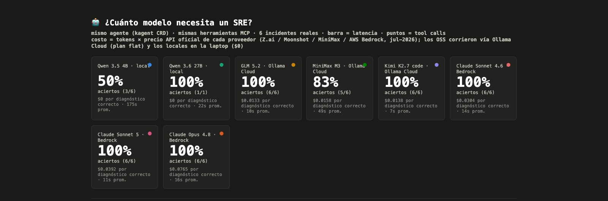

<!-- _class: azul -->
<!-- template: L5 portada onda -->

# El SRE que nunca duerme
### Agentes de IA sobre tu stack de observabilidad open source en Kubernetes

Andrés Zeballos · KCD Lima Perú 2026

<!-- Notas: Me presento en 20 segundos. Todo lo que voy a mostrar corre en un repo público; el QR va al final. Advertencia: esta charla tiene más números que texto — todos con fuente, incluidos los míos. -->

---

<!-- _class: num -->
<!-- template: L4 statement azul -->

# 7:04 p.m.

## Cierras la laptop. Terminaste por hoy.

<!-- Notas: Viernes. Cierras la laptop, terminaste. Pero el celular se queda en la mesa de noche con el volumen al máximo — por si acaso. Todos aquí saben lo que significa ese "por si acaso". Esta charla es esa noche, contada hora por hora. Primero: ¿qué está en juego mientras duermes? Números. -->

---

<!-- _class: num azul -->
<!-- template: L4 statement azul -->

# $15,000

## se pierden por CADA minuto que un sistema está caído

> $600 mil millones al año entre las 2,000 empresas más grandes del mundo — +50% en solo dos años · Splunk / Oxford Economics, mayo 2026

<!-- Notas: No es número de vendor de pánico: Oxford Economics, 2,000 ejecutivos, 20 países, incluye LATAM. Y la mediana de un incidente grave: $2M por hora (New Relic 2025). Cada minuto que tardas en despertar y entender qué pasa, tiene precio. -->

---

<!-- _class: num -->
<!-- template: L4 statement azul -->

# 34%

## de tu semana se va en **toil**: la chamba manual y repetitiva que no construye nada

> Reiniciar pods a mano, revisar alertas falsas, copiar logs a un ticket… · Catchpoint SRE Report: 25% (2024) → 30% (2025) → 34% (2026)

<!-- Notas: Toil = todo lo que haces con las manos, repetido, que mañana hay que volver a hacer. Un tercio de tu semana — y cada año sube. Google puso la línea roja en 50%: pasado eso, ya no eres ingeniero, eres bombero. Y el dato que más duele (NeuBird 2026): 78% tuvo incidentes donde NINGUNA alerta disparó. No falta telemetría; falta alguien que la lea a las 3 de la mañana. -->

---

<!-- _class: num azul -->
<!-- template: L4 statement azul -->

# 7%

## Solo 7 de cada 100 empresas que usan IA generativa la despliegan a diario

> 82% de las empresas ya corre Kubernetes en producción · 66% de la GenAI del mundo corre sobre Kubernetes · CNCF Annual Survey 2025

<!-- Notas: La paradoja, con calma: 82 de cada 100 empresas con contenedores ya corren Kubernetes en producción — eso está resuelto. 66 de cada 100 que usan IA generativa la corren sobre Kubernetes — la IA ya vive ahí. Pero solo 7 de cada 100 la despliegan a diario; el resto la tiene en piloto, en demo, en "la próxima sprint". Entre el 66 y el 7 está el hueco del que trata esta charla: pasar del piloto a la operación de todos los días. -->

---

<!-- _class: num -->
<!-- template: L4 statement azul -->

# $65,000,000

## lo que UNA empresa pagó en UN año — solo por MIRAR sus sistemas

> Coinbase · factura Datadog 2022 (estimación JP Morgan) · ¿el final? migró a Prometheus + Grafana — el mismo stack de esta charla

<!-- Notas: Sesenta y cinco millones de dólares. No por servidores, no por el producto: por la observabilidad — por poder VER sus sistemas. Es estimación de analista, no cifra oficial, lo digo tal cual. El final de la historia es lo bueno: Coinbase lo resolvió migrando a un stack open source — Prometheus, Grafana, ClickHouse. El mismo que vamos a armar hoy. Y ojo (Grafana Survey 2025): observabilidad ya es 17% del gasto de infraestructura promedio. En LATAM, con presupuestos en soles, eso duele doble. Fin de los números — ahora, la historia. -->

---

<!-- template: L3 lista numerada azul -->

## Esta charla es esa noche: de las 7 p.m. a las 3 a.m.

Y la vamos a pasar con tres cosas que esa vez no teníamos:

1. **Un stack open source** que lo ve todo
2. **Un cerebro** que investiga por ti
3. **Control humano** para que no haga tonterías

<!-- Notas: El mapa: open source (Prometheus, Grafana, OpenTelemetry — gratis y reproducible), un cerebro (K8sGPT y kagent — y vamos a MEDIR cuánto cerebro hace falta de verdad), y control humano (nada toca el cluster sin aprobación). El tercer punto es el que separa esta charla del hype. -->

---

<!-- _class: tabla -->
<!-- template: L1 título + tabla -->

## El elenco de esta noche

| | Pieza | Qué hace, en cristiano |
|---|---|---|
| **Base** | OpenTofu | describes tu infraestructura en un archivo, y él la crea por ti |
| | Argo CD | mantiene el cluster idéntico a lo que dice tu repo Git — si algo se desvía, lo corrige |
| **Telemetría** | Prometheus 3 | guarda los signos vitales: CPU, memoria, requests por segundo de cada pod |
| | Grafana 12 | las pantallas: ves esos signos vitales y te llegan las alertas |
| | Fluent Bit 4 | junta los logs de todos los pods y los manda a un solo lugar |
| | OpenTelemetry | el idioma común: métricas, logs y trazas viajan en el mismo formato |
| **IA** | K8sGPT | toma los errores del cluster y te los explica en español |
| | kagent | define agentes de IA en YAML, como cualquier otro recurso de Kubernetes |
| **Modelos** | MCP | el enchufe estándar entre el agente y sus herramientas (kubectl, Prometheus…) |
| | Ollama ↔ Bedrock | dónde vive el modelo: gratis en tu laptop ↔ Claude alquilado en AWS |

<!-- Notas: 60 segundos, una línea por pieza, para que nadie se pierda el resto por no conocer un nombre. Todo es open source o estándar abierto — menos el modelo, que es intercambiable, y eso es justo el punto de la charla. -->

---

<!-- template: L1 título + contenido · 📸 SS: Argo CD con el stack en verde -->

## La escena ya estaba montada — desde hace semanas

📸 *[SS: Argo CD con todas las apps en verde]*

- Todo esto se levantó con **dos comandos**: `tofu apply` y Argo CD sincroniza el resto
- **$0 en licencias** — y el 77% de la industria ya considera clave el open source en observabilidad
- El mismo repo corre en tu laptop o en AWS

<!-- Notas: Este pantallazo es real, del repo. No lo monto en vivo porque son 20 minutos de barras de progreso; el screenshot cuenta la historia: OpenTofu creó la base, Argo CD puso cada pieza en verde, nadie tocó nada a mano. Y esto corría desde hace semanas — importa para lo que viene: la noche del incidente no se instala nada, ya estaba ahí. -->

---

<!-- _class: num azul -->
<!-- template: L4 statement azul · MEME: "This is fine" (perro en la casa en llamas) al lado derecho -->

# 7:31 p.m.

## Suena el celular. Ni llegaste a la cena.

<!-- Notas: Veintisiete minutos después de cerrar la laptop, pasa. Un pod murió, la alerta llegó, y tú ya estabas pensando en otra cosa. El meme va al lado: this is fine. Todos sabemos la noche que se viene: horas de kubectl, grep y dashboards, hasta las 2 o 3 de la mañana. Esa noche es esta charla. Pero hoy hay una diferencia: alguien más ya estaba mirando. -->

---

<!-- template: L1 título + contenido -->

## Los ojos ya estaban abiertos

**K8sGPT**: lee los errores del cluster y los explica en español.

- Proyecto de la **CNCF** — la misma fundación detrás de Kubernetes
- Funciona con **13+ modelos** distintos, locales o en la nube
- **Diagnostica y sugiere. No aplica cambios.**

<!-- Notas: K8sGPT escanea el cluster igual que tú harías con kubectl, pero le pasa lo que encuentra a un modelo de IA y te lo devuelve explicado, en tu idioma. Lo importante: te dice qué pasa, por qué, y qué haría — pero NO toca nada. Para actuar hace falta otra pieza. Para Q&A: v0.4.36, etapa Sandbox de CNCF. -->

---

<!-- template: L1 título + contenido · 📸 SS: salida real de k8sgpt en español -->

## 7:33 p.m. — el diagnóstico llegó solo

📸 *[SS: salida de `k8sgpt analyze --explain` en español]*

"La imagen no existe. Así se arregla." — antes de que encuentres tus lentes.

<!-- Notas: Este pantallazo es de mi cluster, con los mismos comandos del repo. Y no me crean el pantallazo: AL FINAL de la charla lo rompemos y lo diagnosticamos EN VIVO, aquí, sin internet. Por ahora sigamos la noche: saber qué pasó es la mitad; alguien tiene que investigar el resto. -->

---

<!-- template: L1 título + contenido -->

## 7:40 p.m. — alguien tiene que investigar. No tienes que ser tú.

**kagent**: agentes de IA que viven dentro del cluster.

- Lo defines en **YAML**, como cualquier otro recurso de Kubernetes
- Usa herramientas de verdad vía MCP: kubectl, Prometheus, Argo CD
- Proyecto CNCF, creado por Solo.io — el mismo equipo detrás de Istio

<!-- Notas: K8sGPT vio; kagent investiga. Le hablas en lenguaje natural y él decide qué herramientas usar. Uno de los proyectos de agentes que más rápido crece en la CNCF (3,300+ stars). Vecinos honestos, una frase: HolmesGPT, kubectl-ai, Grafana Assistant — cada uno tiene su lugar; lo mío es el stack completo open source con control humano. -->

---

<!-- template: L1 título + contenido · 📸 SS: panel con pregunta y respuesta del agente -->

## El agente investiga solo

📸 *[SS: panel — pregunta en español, respuesta con causa y propuesta]*

"¿Por qué falla el pod y qué dice Prometheus del CPU?" → causa raíz + acción propuesta

<!-- Notas: Pantallazo del panel real: le pregunté en español, él consultó kubectl y Prometheus por su cuenta, y respondió con la causa y una propuesta de arreglo. Ya no estoy leyendo dashboards a las 3 a.m. — alguien los lee por mí. Sacar SS de demo/panel.py (localhost:7777). -->

---

<!-- template: L1 título + contenido · MEME: expanding brain (Qwen 4B → GLM/Kimi → Sonnet → Opus) -->

## En una esquina: los open source. En la otra: los propietarios.

- Cambiar de modelo es **un campo en un YAML** (`ModelConfig`)
- Mismo agente, mismas herramientas — **solo cambia quién piensa**
- Gratis en tu laptop · centavos en la nube open source · Claude para lo pesado

<!-- Notas: Aquí está la pelea de fondo de 2026: ¿necesitas pagarle al modelo más caro del mundo para un pod roto, o el open source ya alcanza? El meme del expanding brain lo plantea en broma; la respuesta va en serio: no opinemos — midámoslo. 42 rounds, ahora. -->

---

<!-- _class: azul -->
<!-- template: L2 divider blob -->

# ¿Cuánto modelo necesita un SRE?

## 6 incidentes × 7 modelos = 42 diagnósticos medidos

<!-- Notas: Benchmark propio, esta semana, sobre este mismo stack: 6 fallos clásicos de Kubernetes (imagen rota, CrashLoop, OOM, config fantasma, probe rota, pod imposible de programar) × 7 modelos, del 4B gratis en mi laptop hasta Claude Opus. Todo medido del tráfico real del agente: tokens, latencia, herramientas, costo a precio oficial de API. -->

---

<!-- template: L1 título + screenshot del report (assets/report-tiles.png) -->

## Acertar ya cuesta centavos



<!-- Notas: Tres lecturas: (1) el 4B local GRATIS resuelve la mitad — para el triage nocturno no es poco; (2) los open source hosteados (GLM, Kimi) igualan a Claude en estos incidentes por ~1.3 centavos por diagnóstico — un quinto del precio; (3) los Claude no ganan aquí en aciertos, ganan en disciplina: Sonnet 5 resuelve en 1.5 pasos promedio. TODAS las corridas de Claude juntas: $0.88. Caveats en voz alta: 6 incidentes estándar, puntaje verificado por mí, Kimi es un modelo para código. -->

---

<!-- _class: num -->
<!-- template: L4 statement azul · MEME: Pepe Silvia (Charlie Day y su muro de conspiración) -->

# 13.2 pasos · 39,000 tokens

## MiniMax llegó a la respuesta. Nadie sabe cómo.

<!-- Notas: MiniMax acertó 5 de 6… pero mírenlo en el reporte: hasta 18 pasos y 39 mil tokens en un solo diagnóstico. El Pepe Silvia de los agentes — el meme va al lado. ¿Qué significa esto? Siguiente slide. -->

---

<!-- template: L1 título + contenido -->

## ¿Qué le pasó a MiniMax?

- En agentes no pagas por respuesta: pagas **precio × pasos** — cada vuelta extra son tokens
- MiniMax quemó hasta **39,000 tokens** en un diagnóstico; los directos usan **~5,000**
- Un modelo barato pero caótico te puede costar lo mismo que uno caro y directo

<!-- Notas: Esta es la lección técnica escondida del benchmark: el precio por token es la mitad de la historia; la otra mitad es la disciplina — cuántas vueltas da antes de responder. Por eso MiniMax, siendo 3-4 veces más barato por token que GLM, terminó costando casi lo mismo por diagnóstico. -->

---

<!-- template: L1 título + contenido -->

## La lección: no llames al SOTA para cada incidente

- Los modelos open source van **3–4 meses** detrás de los mejores — Epoch AI, may 2026
- **9 de los 13** modelos con mejor precio/inteligencia son open source: lo mismo a **½–⅙ del precio** — Artificial Analysis, abr 2026
- A capacidad constante, la inferencia se abarata **~10× por año** — a16z

**El propietario top, para lo que nadie ha visto antes. El open source, para el turno de noche.**

<!-- Notas: Y no es solo mi benchmark: GLM 5.2 — el mismo que sacó 6/6 aquí — ya supera a modelos propietarios de punta en benchmarks de código (SWE-bench Pro: 62.1% vs 58.6% de GPT-5.5). El gap que queda es en tareas largas y abiertas, no en el diagnóstico de manual. Traducción: contratar al modelo más caro para un ImagePullBackOff es contratar un neurocirujano para poner una curita. -->

---

<!-- template: L1 título + contenido -->

## ¿Entonces la IA ya resolvió el on-call? No.

- IBM puso agentes a resolver **incidentes reales, complejos y abiertos**: resolvieron **~1 de cada 8** (ITBench, 2025)
- Los mejores modelos del mundo: **menos de la mitad** de aciertos diagnosticando Kubernetes (may 2026)
- Lo que yo mostré son **los fallos de manual** — esos sí ya se diagnostican solos, y por centavos

<!-- Notas: Esta slide me compra credibilidad: no vine a decir que la IA resolvió SRE. Cuando IBM y Microsoft ponen agentes contra incidentes de verdad — de esos que no salen en el manual — resuelven poquísimo (11-14% ITBench, mitigación ≤54.5% AIOpsLab). Lo que cambió es el piso: los fallos repetidos, los que te despiertan a las 3 a.m., ya se diagnostican solos. La frontera sigue lejos; el piso ya es útil. -->

---

<!-- template: L3 lista numerada azul -->

## 1:58 a.m. — el fix está listo. ¿Lo dejamos aplicarlo solo?

**Todavía no. Y quien te diga lo contrario, te está vendiendo algo.**

1. La remediación 100% autónoma **sigue siendo una promesa**, no un producto
2. Gartner: **más del 40%** de los proyectos de agentes de IA serán **cancelados** antes de 2028
3. El freno: **un humano aprueba** antes de tocar el cluster + permisos de solo lectura

<!-- Notas: ¿Por qué la 1:58 si el diagnóstico llegó a las 7:33? Porque un incidente de verdad no es un pod roto: hubo hipótesis, pruebas, un rollback. La diferencia es QUÉ hiciste esas horas: no estuviste grepeando a ciegas — el agente investigaba y tú decidías. Y ahora que el fix está listo: si les vendo clusters que se curan solos, les miento — Gartner le pone número: 40% de proyectos cancelados para fin de 2027, "agent washing" en miles de vendors. Lo que SÍ va a producción hoy: el agente ve, explica y propone; el humano aprueba. kagent trae esa aprobación integrada (human-in-the-loop). -->

---

<!-- template: L1 título + contenido -->

## Tres preguntas que hoy nadie puede responder

- ¿**Quién es** este agente? — identidad
- ¿**Qué puede tocar** y qué no? — permisos
- ¿**Quién audita** lo que hizo a las 3 a.m.? — trazabilidad

Quiénes ya trabajan en esto: MCP en la Linux Foundation · OWASP MCP Top 10 (beta) · SPIFFE/SPIRE

<!-- Notas: Con humanos esto está resuelto hace años: usuarios, RBAC, audit log. Con agentes, no: no hay un estándar de identidad de agente, ni de límites, ni de auditoría. Es la frontera abierta de 2026, y decir "esta capa todavía no existe del todo" es la respuesta correcta. Si alguien les dice que ya lo resolvió, desconfíen. -->

---

<!-- _class: azul -->
<!-- template: L2 divider blob -->

# [DEMO EN VIVO] No me crean nada: rompámoslo juntos

```
kubectl run roto --image=nginx:noexiste
k8sgpt analyze --explain --language spanish
```

<!-- Notas: El cierre de la historia, en vivo: rompo un pod igual que se rompió a las 7:31, y K8sGPT lo diagnostica en español, aquí, delante de ustedes. Corre 100% local con Qwen en Ollama, offline — el WiFi de la conferencia no me lo puede arruinar. [Si algo falla: el clip de respaldo está a un click.] -->

---

<!-- template: L1 título + contenido · QR grande -->

## 2:47 a.m. — fix aprobado, cluster en verde. Ahora sí: a dormir.

El repo trae **todo lo de esta charla**, listo para una tarde:

- Las **dos rutas** completas: tu laptop ($0, offline) y AWS (EKS + Bedrock), mismos YAML
- El **benchmark entero**: código, datos y reporte — corre tus propios 42 diagnósticos
- El guion de comandos paso a paso, y las **fuentes de cada número** que viste hoy

(QR al repo)

<!-- Notas: Así termina la noche: a las 2:47, no al amanecer — y las horas del medio las pasaste decidiendo, no grepeando. Esa es la versión honesta y replicable de "el SRE que nunca duerme": el que no duerme es el agente; tú sí. Nada de esto necesita presupuesto: la ruta laptop es gratis de punta a punta. -->

---

<!-- _class: azul num -->
<!-- template: L5 onda de cierre -->

# Gracias

## ¿Preguntas?

<!-- Notas: Cierre a tiempo para 5 min de Q&A. Si preguntan por el benchmark: 6 incidentes estándar, puntaje revisado, reproducible con demo/bench/bench.py. La slide siguiente (fuentes) queda proyectada durante el Q&A. -->

---

<!-- _class: fuentes -->
<!-- template: L1 título + lista de links -->

## Fuentes — cada número de esta charla

- [CNCF Annual Cloud Native Survey 2025](https://www.cncf.io/announcements/2026/01/20/kubernetes-established-as-the-de-facto-operating-system-for-ai-as-production-use-hits-82-in-2025-cncf-annual-cloud-native-survey/) — 82% · 66% · 7%
- [Splunk / Oxford Economics, Hidden Costs of Downtime](https://www.prnewswire.com/news-releases/the-600-billion-wake-up-call-new-splunk-research-reveals-downtime-is-a-systemic-business-crisis-302774919.html) — $15,000/min · $600B/año
- [Catchpoint, The SRE Report 2026](https://www.logicmonitor.com/press/the-sre-report-2026-reliability-is-being-redefined) — toil 34% · [Google SRE](https://sre.google/sre-book/eliminating-toil/) — tope 50%
- [The Pragmatic Engineer](https://blog.pragmaticengineer.com/datadog-65m-year-customer-mystery/) — la factura de $65M · [Grafana Obs. Survey](https://grafana.com/blog/observability-survey-takeaways/) — 17% del gasto de infra, 77% open source
- [ITBench — IBM Research, ICML 2025](https://arxiv.org/abs/2502.05352) — 11–14% · [ITBench-AA](https://artificialanalysis.ai/evaluations/itbench-aa) — frontier <50% · [AIOpsLab — Microsoft](https://arxiv.org/abs/2501.06706)
- [Epoch AI](https://epoch.ai/data-insights/open-closed-eci-gap) — open a 3–4 meses · [Artificial Analysis](https://artificialanalysis.ai/articles/recent-open-weights-model-launches) — 9/13 Pareto, ½–⅙ precio · [a16z](https://a16z.com/llmflation-llm-inference-cost/) — 10×/año
- [Gartner](https://www.gartner.com/en/newsroom/press-releases/2025-06-25-gartner-predicts-over-40-percent-of-agentic-ai-projects-will-be-canceled-by-end-of-2027) — >40% cancelados para 2027
- **Benchmark propio**: 6 incidentes × 7 modelos — código, datos y reporte en este repo (`demo/bench/`)

<!-- Notas: Queda proyectada durante el Q&A. La versión extendida con caveats está en slides/fuentes.md del repo. -->
